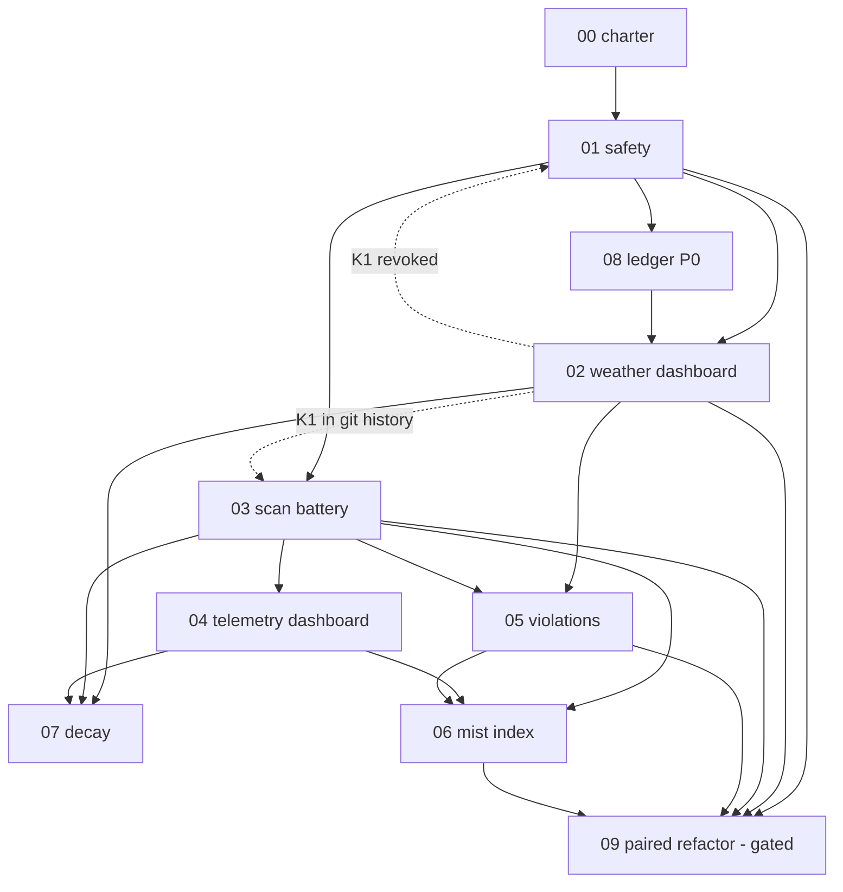

# Mist — Roadmap & EPIC Numbering Policy

*Created 2026-08-22 at commit `1e69b61`. Source of truth for the EPIC number space
in this repository. Companion to `docs/mist-concept-evaluation.md`.*

---

## What Mist is

Mist is the **negative control** of the Controllability framework: a working,
deployable Node.js/React weather dashboard built with maximal dependency surface
and no purity partition, with a full scan battery wired into CI so the project
continuously measures its own decay (`docs/mist-concept-evaluation.md:5-9`).

The deliverable is **evidence, not a product**. Every EPIC below exists to make
the argument citable rather than merely cautionary.

---

## Numbering policy

- Mist numbers **locally**. It does not participate in the `pkcore` family's
  cross-repo ten-block namespacing; it is a standalone demonstration repo.
- Files are `EPIC-<NN>[<letter>]_Title_In_Snake_Case.md` in `docs/`, `NN`
  zero-padded and sequential.
- `00` is the foundational/charter band. `01`–`09` are the initial build run.
- Sub-letters (`02a`, `09a`) mark a child or tangent of a base EPIC.
- Specials, when they arrive, park high: `66` / `79` / `95`–`99` / `999`
  (meta, backlog, ramblings).
- "Next number" means one past the **sequential frontier** — the contiguous run
  from `00` — never max+1.

## Progress convention (repo-wide)

The **`## Status` table inside each EPIC is the canonical live signal.** Work Item
checkboxes stay `- [ ]`; do not check them. Flip Status rows to `**Complete**` /
`**Deferred**` only when landed code proves it, pinned to a named commit and date.
This follows the `pkcore` modern convention, not the `cardpack.rs` adaptation.

## Toolchain decisions (fixed, and deliberately)

| Decision | Choice | Why |
|---|---|---|
| Package manager | **npm** | The median choice. `pnpm`'s cooldown policy and `--ignore-scripts` defaults are the counter-genre Mist is the control group for (`docs/mist-concept-evaluation.md:74`). Adopting them would mitigate the thing being measured. |
| Install scripts | **Enabled** | No `--ignore-scripts`. Install scripts are remote code execution you scheduled yourself (`docs/mist-concept-evaluation.md:43`); the exposure must be real for the scans to have something true to say. |
| Semver ranges | **Wide open** (`^`) | Dependencies that update under semver ranges are a hidden input channel (`docs/mist-concept-evaluation.md:19`). |
| Lockfile | **Committed** | It is Mist's parody of event sourcing: a perfect, deterministic record of every decision *not* made (`docs/mist-concept-evaluation.md:23`). |
| Scan jobs in CI | **Non-blocking** | A red scan is data, not a blocker. Gating merge on findings would stop the project recording its own decay. |

---

## The EPIC map

| EPIC | Title | Role | Status |
|---|---|---|---|
| [EPIC-00](EPIC-00_Charter_And_Anti_Kernel_Thesis.md) | Charter & Anti-Kernel Thesis (CHARTER) | The rules of the demonstration: counter-invariants, the Medianness Test | Landed |
| [EPIC-01](EPIC-01_Safety_Scoping_And_Containment.md) | Safety Scoping & Containment (SAFE) | The exposure/exploitation line; blocks everything else | Landed — one gap found by EPIC-02: a global `~/.npmrc` bypasses the hygiene check |
| [EPIC-02](EPIC-02_The_Weather_Dashboard.md) | The Weather Dashboard (WX) | The working, median, rotten application | Built — 737 packages, live weather, K1 committed and revoked. Deploy still blocked |
| [EPIC-03](EPIC-03_The_Scan_Battery.md) | The Scan Battery (SCAN) | Compensatory observability, wired into CI | Live — first real run 2026-09-03; behavioural SCA still unwired (Phase 2a) |
| [EPIC-04](EPIC-04_Public_Telemetry_Dashboard.md) | Public Telemetry Dashboard (DASH) | The permanent public artifact; the book's figure | Built, unpublished — needs GitHub Pages enabled by an admin |
| [EPIC-05](EPIC-05_Violation_Inventory.md) | Violation Inventory (VIOL) | `VIOLATIONS.md` — each dep mapped to the invariant it breaks | Landed — 47 entries, 19 evidenced violations, blocking gate |
| [EPIC-06](EPIC-06_The_Mist_Index.md) | The Mist Index (MI) | Scan spend as a quantitative proxy for surrendered controllability | Built — and reports NOT COMPUTABLE: 3 of 5 axes have no instrument |
| [EPIC-07](EPIC-07_Longitudinal_Decay.md) | Longitudinal Decay (DECAY) | A frozen tree rescanned monthly; telemetry of entropy | Planned |
| [EPIC-08](EPIC-08_Agentic_Construction_Log.md) | Agentic Construction Log (LOG) | Primary-source evidence for "add a package for that" | Capturing — 35 install records, 11 corrections from session 001 |
| [EPIC-09](EPIC-09_The_Paired_Refactor.md) | The Paired Refactor (PURE) | The same domain rebuilt kernel-first; before/after | 🔒 Gated |

## Build order

**Each EPIC's own `## Dependencies` block and `Phase 0 — Prerequisites`
checklist are the source of truth.** This section is a derived summary. If the
two ever disagree, the EPIC wins and this section is the bug.

### Prerequisite matrix

| EPIC | Cannot **start** until | Cannot **close** until |
|---|---|---|
| 00 CHARTER | — | — |
| 01 SAFE | 00 | 02 Phase 2 (K1 committed, then revoked) |
| 08 LOG (Phase 0) | 00, 01 | 02 closes — the ledger is captured *during* 02 |
| 02 WX | 00, 01, **08 Phase 0** | — |
| 03 SCAN | 00, 01 | 02 Phase 2e (gitleaks must see K1 in history) |
| 04 DASH | 03 | — |
| 05 VIOL | 00, 02, 03 Phase 2 | — |
| 06 MI | 03, 04, 05 | 04 has ≥180 days of history for A5, or A5 ships as `insufficient-history` |
| 07 DECAY | 02 (`v1.0.0` tag), 03, 04 | at least one monthly rescan has run |
| 09 PURE | 01, 02, 03, 05, 06 | — |

EPIC-00 gates everything transitively: no dependency may be installed before it
lands. EPIC-07 and EPIC-09 block nothing — they are terminal.

### Graph

Solid arrow = "must land before". Dashed arrow = a *back-edge*: work in EPIC-02
is what finally lets an earlier EPIC close.

### The two constraints that are easy to miss

1. **EPIC-08 Phase 0 must land before EPIC-02 Phase 1.** The install ledger
   cannot be reconstructed after the fact — that is the whole evidentiary value.
2. **EPIC-01 and EPIC-03 cannot close before EPIC-02 Phase 2.** Both own a check
   whose subject (the K1 credential) does not exist until the weather provider is
   wired. Start them early; close them late.
